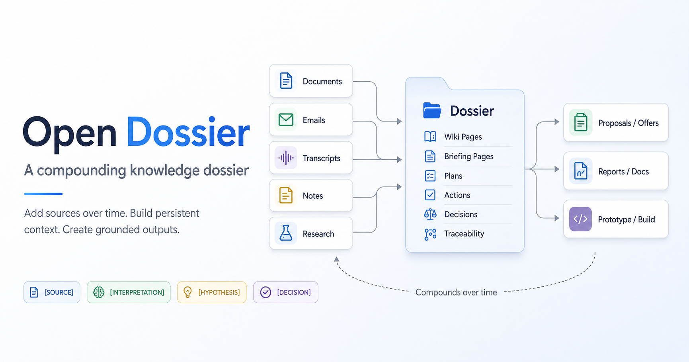

# Open Dossier



**A compounding knowledge dossier for work that starts with sources and ends in outcomes.**

Open Dossier is an open-source [Claude skill](https://docs.claude.com/en/docs/agents-and-tools/agent-skills) for building a persistent body of knowledge from documents, emails, transcripts, notes, presentations and research.

Start with an empty dossier. Add sources as your work progresses. Open Dossier preserves them, analyzes what matters, connects new information to what is already known and keeps the whole dossier coherent over time.

The result is more than a searchable archive or a collection of summaries. It becomes working context Claude can use to:

- create proposals, reports and other documents;
- develop plans and recommendations;
- produce prototypes and implementation artefacts;
- maintain technical and architectural documentation;
- track actions, decisions, assumptions and open questions;
- answer questions without rebuilding the context every time.

## Knowledge that compounds into work

Most AI workflows are temporary. You provide some documents, generate an answer and lose most of the accumulated understanding when the session ends.

Open Dossier is designed around the opposite model. Every source adds to a persistent knowledge structure:

- **Original sources** remain preserved and immutable.
- **Analyses** extract the information that matters.
- **Wiki pages** combine knowledge across sources.
- **Briefings** capture the current state.
- **Plans, actions and decisions** connect knowledge to execution.
- **New outputs** are grounded in the full accumulated context.

Each substantive claim is labelled as one of `[SOURCE]` · `[INTERPRETATION]` · `[HYPOTHESIS]` · `[DECISION]`. That makes the dossier useful not only for retrieving information, but also for producing trustworthy work: you can see what came directly from a source, what was inferred, what still needs confirmation and what has actually been decided.

Add sources. Compound knowledge. Use it to make things.

## The idea behind it

Open Dossier combines two ideas:

1. **The LLM wiki** — after [Andrej Karpathy's LLM Wiki concept](https://gist.github.com/karpathy/442a6bf555914893e9891c11519de94f): instead of retrieving document chunks fresh on every question (RAG), the model maintains a compounding set of markdown pages. Each ingested source improves the whole. Humans abandon wikis because maintenance grows exponentially; an LLM does the bookkeeping reliably at near-zero cost.
2. **Source-driven execution** — the goal is not to summarize documents, but to extract what leads to a decision, a plan or an action. Every substantive statement carries an epistemic label, so execution stays traceable to the sources it came from.

## What a dossier looks like

```
my-project/
├── DOSSIER.md          # schema: scope, conventions, actors
├── briefing.md         # living synthesis: current state in one page
├── index.md            # catalog: every page, one line each
├── log.md              # append-only journal
├── sources/
│   ├── originals/      # immutable input documents
│   ├── converted/      # markdown conversions
│   └── analyses/       # compact analysis per source
├── wiki/               # entity and topic pages
├── plans/              # numbered living plans
├── actions.md          # central action register
├── decisions.md        # decision log
└── backlog.md          # open questions, sources to process
```

## Operations

| Operation | What it does |
|---|---|
| `init` | Scaffold a new dossier and write its schema |
| `ingest <doc>` | Full pipeline: preserve → convert → register → analyze → compound the wiki → update plans/actions/decisions → update briefing/index/log |
| `query <question>` | Answer from the dossier with citations; file valuable syntheses back in |
| `lint` | Health check: contradictions, stale claims, orphans, traceability gaps, index drift |
| `brief` | Refresh the one-page living synthesis |

## Install

### Claude Code (terminal) — as a plugin (recommended)

```
/plugin marketplace add jpaarhuis/open-dossier
/plugin install open-dossier@open-dossier
```

### Claude Desktop app

The `/plugin` slash commands are not available in the desktop app; add the marketplace through the UI instead:

1. Open **Settings → Plugins**
2. Click **Add → Add marketplace** and enter `jpaarhuis/open-dossier`
3. Enable the **open-dossier** plugin from the list

### Claude Code — manual

Copy the skill folder into your skills directory:

```bash
# personal (all projects)
git clone https://github.com/jpaarhuis/open-dossier
cp -r open-dossier/skills/open-dossier ~/.claude/skills/

# or project-only
cp -r open-dossier/skills/open-dossier your-project/.claude/skills/
```

### Claude.ai (web)

Upload the skill via **Settings → Capabilities → Skills**: zip the `skills/open-dossier/` folder (the zip must contain `SKILL.md` at its root) and upload it. This also works in the desktop app if you prefer a skill-only install over the plugin.

## Use

```
/open-dossier init                       # set up a dossier in the current folder
/open-dossier ingest meeting-notes.docx  # process a document end-to-end
/open-dossier query what did we decide about the migration?
/open-dossier lint                       # health check
/open-dossier brief                      # refresh briefing.md
```

Or just talk: *"ingest this transcript into the dossier"*, *"what do we know about vendor X?"* — the skill triggers on intent, not only on slash commands.

## Why labels matter

The four labels are the epistemic backbone:

- `[SOURCE]` — stated literally in a source (always cites a source ID)
- `[INTERPRETATION]` — analysis or inference
- `[HYPOTHESIS]` — assumption awaiting confirmation
- `[DECISION]` — a settled choice, logged in `decisions.md`

A reader — human or a future Claude session — can instantly see what is fact, what is inference and what still needs confirmation. Hypotheses get promoted to decisions or killed, never silently forgotten. Contradictions between sources are recorded with both source IDs and flagged, not papered over.

## Design principles

- **Originals are immutable.** Claude reads them, never edits them.
- **Compound, don't summarize.** An ingest updates entity pages, plans and the briefing — the value is in the cross-referencing, not the summary.
- **Everything traceable.** Every action has an origin; every fact has a source ID.
- **Humans decide, Claude does bookkeeping.** Contradictions and stale hypotheses go to you; index maintenance and link fixing don't.
- **Write for the next reader.** Absolute dates, no session-local shorthand — a future session has a different "now".
- **A dossier keeps working without the skill.** `DOSSIER.md` plus the existing files teach the workflow, so even a Claude session that doesn't have the skill installed can read and extend the dossier correctly.

## Credits

- Wiki concept: [Andrej Karpathy — LLM Wiki](https://gist.github.com/karpathy/442a6bf555914893e9891c11519de94f)
- Source-driven workflow distilled from real-world consulting document pipelines

## License

[MIT](LICENSE)
